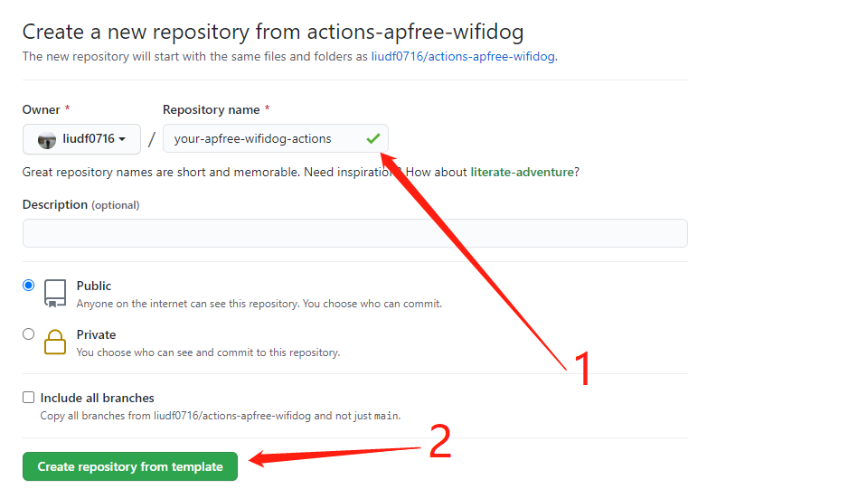
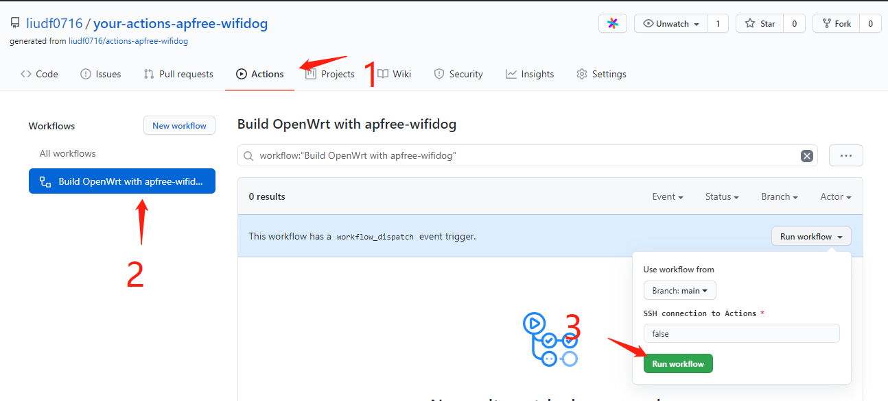
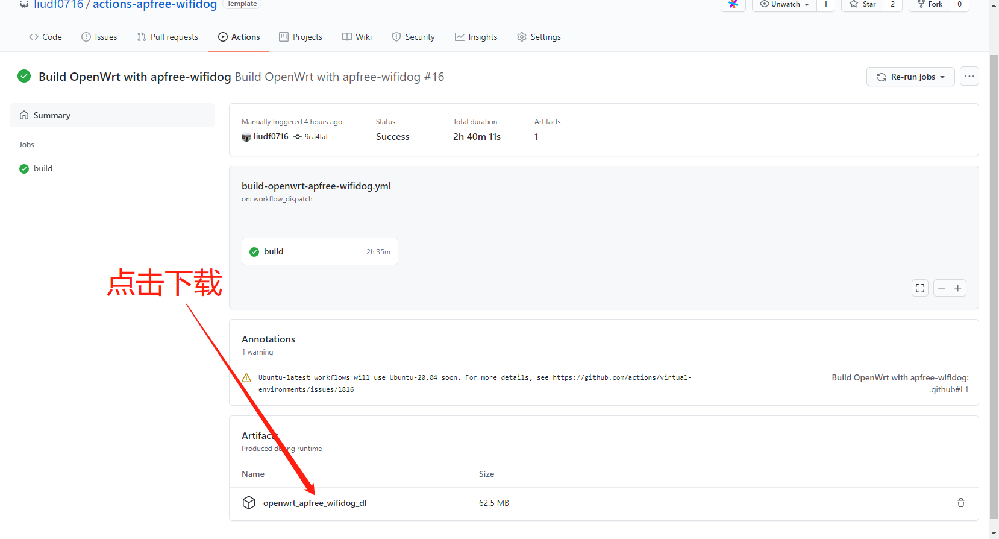
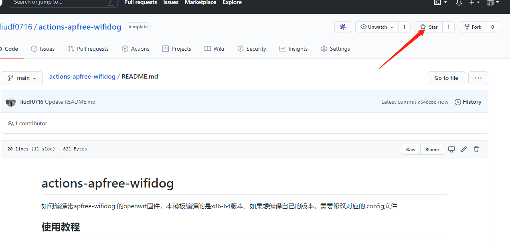

# actions-apfree-wifidog

如何编译带apfree-wifidog 的openwrt固件，本模板编译的是x86-64版本，如果想编译自己的版本，需要修改对应的.config文件

## 使用说明

 - 点击[模板](https://github.com/liudf0716/actions-apfree-wifidog/generate)，填写项目名称后，点击`Create repository from template`
 
 
 
 - 点击 Actions进入Actions页面，按照下图指示步骤操作后就开始编译带apfree-wifidog的x86 openwrt固件了
 
 
 
 - 等待2个多小时后，即可从下图所示的位置下载相应的固件及apfree-wifidog代码及ipk包了

- 点击右上角 Star，给作者加油

